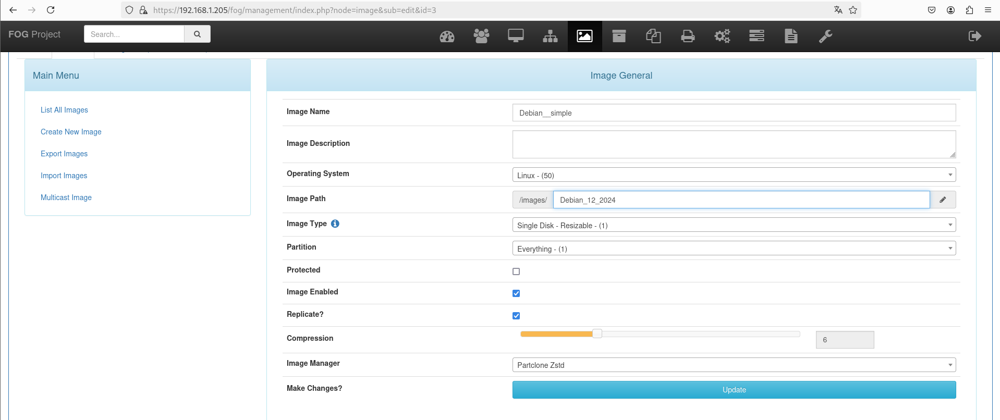
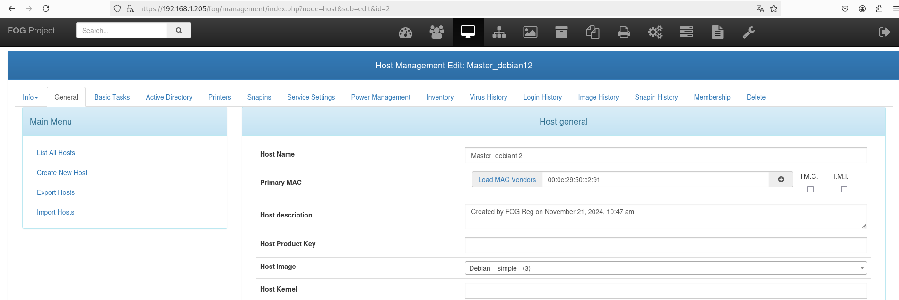
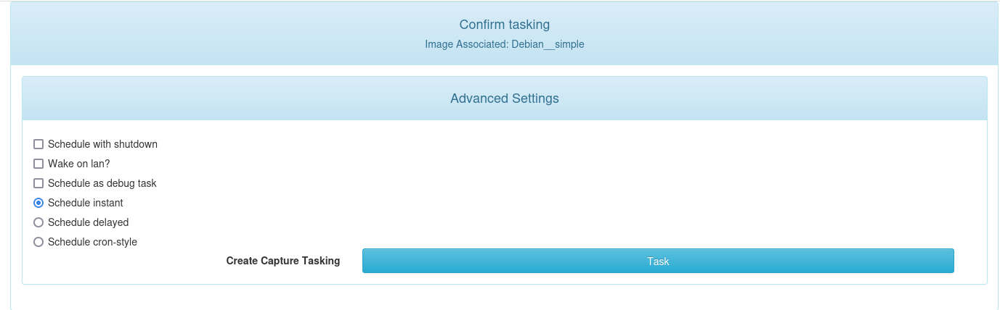
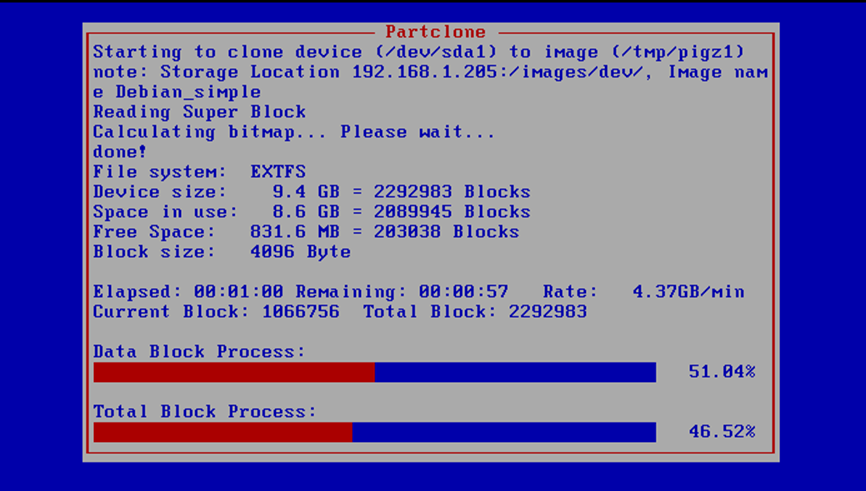
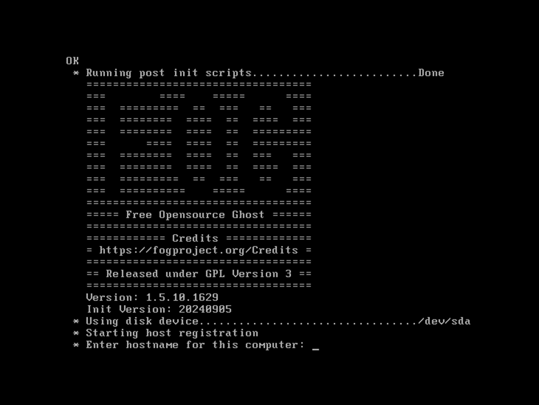

# Déploiement d'un OS

Le déploiement d’un système d’exploitation avec FOG suit un processus structuré en plusieurs étapes. Cela implique de travailler avec une machine "master" (qui contient l’OS à capturer) et une ou plusieurs machines "cibles" (qui recevront l’image du master). 

## Etape 1 : Démarrage de la machine via le réseau 

Pour enregistrer une machine, nous allons  modifier les paramètres du BIOS pour qu'il démarre à partir du réseau : 

On place l'option "Network boot from Intel E1000" en haut de la liste et on sauvegarde.

Une fois les paramètres sauvegardés, la machine redémarrera d'elle-même. 

Configuré en mode DHCP, la machine va envoyé des requêtes nommé "DHCP discover" pour obtenir une adresse IP. Cette même requête va être reçu par :
- le serveur DHCP qui va lui fournir une configuration réseau
- le proxyDHCP qui va lui fournir l'adresse IP du serveur FOG

## Etape 2 : Enregistrement de la machine Master

Une fois que la machine a réussi à joindre les serveurs DHCP et obtenu toutes les informations dont elle avait besoin, le menu de démarrage s'affiche. Ce menu de démarrage contient plusieurs possibilités qui vont nous permettre de réaliser plusieurs actions comme le déploiement d'un OS, l'enregistrement d'une machine rapide ou complète...

Nous allons choisir "Quick registration and inventory" pour pouvoir enregistrer rapidement la machine cliente dans le serveur FOG avec un inventaire matériel minimal. 

Une fois l'enregistrement terminé, la machine apparait dans la liste des hôtes sur le serveur FOG.

## Etape 3 : Capture d'un OS

Pour capturer l'image d'une machine déjà capturé, il faut :

a.) Création d'une image

Créer une image sur le serveur comme sur l'illustration ci-dessous.

b.) Association dde l'image à la machine master

Associer cette image à la machine master dont vous souhaiter capturer l'OS. Ici le master est sous Debian 12.

c.) Planifier une tâche pour capturer l'OS

Pour capturer l'OS vous devez créer une tâche qui va lancer à distance la capture de l'OS sur la machine. 

Dans le menu de l'**host master**, rendez-vous dans le menu "Basic Tasks" > Capture. 

Lancer la tâche imédiatement. A noter qu'il y a plusieurs options séléctionnables pour la tâche planifié comme éteindre la machine après l'éxécution de la tâche... mais je vous laisserais découvrir ces options par vous-mêmes.

Dans le menu des tâches en cours , on voit notre tâche progresser 

Et si l'on se rend sur notre machine master, on voit ceci : 

c.) Vérifier que l'OS a bien été capturé

Une fois la tâche terminé,vous pouvez voir les informations sur la dernière capture effectué pour cette image comme la taille de celle-ci,...

## Etape 4 : Déploiement rapide d'un OS

Pour des déploiements rapide, il est possible au moment de l'enregistrement de déployer l'OS sur les machines clones.

Pour cela, il suffit de prendre la machine sans image que vous avez créee au début de la démarrer via le réseau en changeant les paramètres du BIOS comme nous l'avons vu à l'étape 1. 

Une fois cela fait, nous allons cette fois réaliser un enregistrement complet de la ma chine en sélectionnant " Perform Full Host Registration and Inventory"

Cela va lancer l'enregistrement en vous posant plusieurs questions notamment le nom par lequel il sera nommé sur le serveur FOG, l'image que vous souhaitez lui associer...

Et la dernière question va vous permettre de lancer le déploiement de l'OS immédiatement. après cela plus qu'à patienter ! 

## Etape 5 : Démonstration complète de déploiement d'OS

Voici une démonstration complète d'un déploiement d'OS que j'ai pu réaliser.

...

